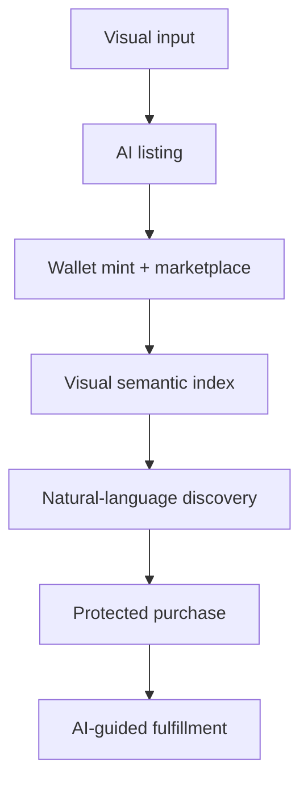

# Realife

An open AI commerce MVP where a creator can turn visual media into a structured
listing, buyers can search in natural language, and both sides can follow a
protected fulfillment flow.

[Live Base Sepolia MVP](https://realife.live) ·
[Companion media service](https://github.com/BornUkraine/realife-backend)

> **Status:** experimental testnet software. Realife has not received an
> independent application or smart-contract audit. Do not use the current
> deployment to control mainnet funds or irreplaceable assets.

## Why this exists

Most commerce software asks people to think like a database: choose a taxonomy,
fill long forms, guess keywords, and manually interpret transaction state.
Realife tests a different interface: show the system an item or service, then
describe what you want in ordinary language.

The current MVP connects four inspectable AI systems:

| System | Input → output | Implementation |
| --- | --- | --- |
| Listing assistant | image/video → structured listing fields | backend `/api/ai-suggest` + create flow |
| Visual enrichment | NFT image/poster + metadata → persistent semantic fields and tags | `app/api/ai/nft-enrich` + `NftAiIndex` |
| Trading search | natural language → allow-listed marketplace filters | `app/api/ai/trading-search` |
| Fulfillment assistant | authorized order state → next steps, risks, checklist, suggested message | `app/api/ai/order-assist` |

These components form one pipeline:



AI does not sign transactions, release escrow, issue refunds, or decide
disputes. The order assistant is advisory; authorization and value-changing
actions remain in application and on-chain logic.

## Repository scope

Despite the historical name, this repository contains the full Next.js
application and server routes: UI, authentication, Prisma/PostgreSQL data
model, indexers, marketplace APIs, the semantic index, trading search, and
order assistance.

The companion backend handles media upload, multimodal listing suggestions,
IPFS metadata creation, and read-only ERC-1155 metadata resolution. This
repository includes contract ABIs and testnet integration code, but **does not
currently include Solidity source or deployment scripts**. The deployed
contracts must not be described as open source solely because their ABIs are
public.

See [`docs/ARCHITECTURE.md`](./docs/ARCHITECTURE.md) for boundaries and
[`docs/AI_EVALUATIONS.md`](./docs/AI_EVALUATIONS.md) for the current evaluation
scope. The grant-ready work packages are in
[`docs/ROADMAP.md`](./docs/ROADMAP.md).

## Local development

Requirements:

- Node.js 20.19 or newer
- npm 10.8 or newer
- PostgreSQL
- the companion backend for media upload and listing suggestions
- a Base Sepolia wallet/provider configuration

```bash
git clone https://github.com/BornUkraine/realife-frontend.git
cd realife-frontend
npm ci
cp .env.example .env.local
npx prisma migrate deploy
npm run verify
npm run dev
```

Open `http://localhost:3000`. The minimum server configuration is a PostgreSQL
`DATABASE_URL`, `NEXTAUTH_URL`, and a generated `NEXTAUTH_SECRET`. Wallet,
email, social login, AI, faucet, and indexer features each need their own
optional variables documented in [`.env.example`](./.env.example).

Generate a secret locally:

```bash
openssl rand -base64 32
```

Never expose server secrets through a `NEXT_PUBLIC_` variable.

## Verification

```bash
npm run lint
npm run typecheck
npm test
npm run eval:ai
npm run verify
```

`npm run eval:ai` is a deterministic regression evaluation for the local
natural-language fallback parser. It is intentionally not presented as a
benchmark of hosted-model quality. Reproducible model-backed and human-rated
evaluation sets remain open work.

## Technology

- Next.js 16 and React 19
- TypeScript
- PostgreSQL and Prisma
- Base Sepolia, viem, wagmi, RainbowKit, and Web3Auth
- server-side model calls with strict JSON schemas
- IPFS-compatible metadata and media gateways

## Contributing and security

Read [`CONTRIBUTING.md`](./CONTRIBUTING.md) before proposing changes. Report
security issues through the private process in [`SECURITY.md`](./SECURITY.md),
not a public issue.

## License

Apache License 2.0. See [`LICENSE`](./LICENSE).
